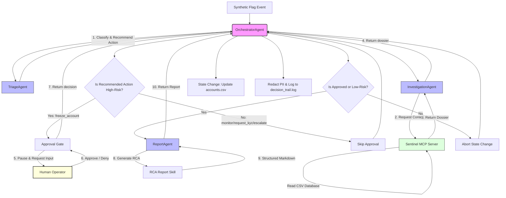

# Sentinel — Trust & Safety incident-triage assistant

> A multi-agent Trust & Safety incident-triage pipeline for a cryptocurrency exchange built using Google ADK (`google-adk`), Gemini, and the Model Context Protocol (MCP).

---

## 🌌 Overview & The Problem

In a cryptocurrency exchange, Trust & Safety (T&S) compliance requires rapid, high-confidence triage and investigation of suspicious account activities. Manual analysis of every automated flag is slow and prone to human error, yet fully automated workflows are highly risky: false-positive freezes damage customer relationships, and unauthorized state changes may violate regulatory rules.

**Sentinel** solves this challenge by implementing a secure, multi-agent automated triage pipeline. Sentinel orchestrates specialized AI agents to classify risk events under strict policy constraints, neutrally compile investigation dossiers via a local MCP server database, enforce Human-in-the-Loop safeguards for high-risk actions (e.g. account freezing), and draft incident Root Cause Analysis (RCA) reports—all while redacting sensitive PII from logs.

---

## 🤖 Why Agents?

Instead of a monolithic script, Sentinel divides the investigation process into single-responsibility, bounded agents. This design pattern offers substantial security, performance, and maintainability advantages:

1. **Policy Confinement (TriageAgent)**:
   The `TriageAgent` classifies risk flags against a predefined rules policy. To prevent unauthorized capabilities or code injection, it has **no access to external tools or databases**. It functions strictly as a pure decision/classification function.
2. **Isolated Tool Access (InvestigationAgent)**:
   The `InvestigationAgent` is the only agent with access to the local database tools. Restricting tool capabilities to a single agent minimizes token usage, avoids prompt pollution, and isolates database read permissions from the decision-making nodes.
3. **Decoupled Orchestration (OrchestratorAgent)**:
   The `OrchestratorAgent` manages the pipeline sequence, handles control flow logic, performs input validation, and enforces PII redaction. Keeping flow orchestration decoupled from agent prompts ensures the execution pipeline remains predictable and reliable.
4. **Human-in-the-Loop (HITL) Gatekeeping (ApprovalGate)**:
   Any action deemed high-risk (such as freezing a customer's account) automatically triggers the `ApprovalGate` to pause execution, requiring explicit approval from a human operator before any state change is committed.
5. **Presentation Decoupling (ReportAgent & RCA Skill)**:
   The `ReportAgent` uses a reusable python-based skill to draft structured markdown reports. This separates the presentation layer from the core triage logic; compliance reporting templates can be modified without altering decision policies or database schemas.

---

## 📐 Architecture & Flow

The following sequence diagram outlines the Sentinel pipeline workflow, demonstrating the progression from triage through investigation and operator approval to logging and reporting:



---

## 🌟 Concepts Demonstrated

### 🤝 1. Multi-Agent System (ADK)
Sentinel is built on the Google Agent Development Kit (`google-adk`). It uses the `Workflow` API to construct the pipeline, the `Agent` API to define specialized personas with custom prompts, and the `Context` API to run sub-agents as node computations.

### 🔌 2. Model Context Protocol (MCP) Server
To lookup customer contexts securely, Sentinel runs a local `FastMCP` server (`mcp_server/server.py`) over a standard input/output (`stdio`) transport sub-process. The server exposes four read-only tools to fetch database records:
*   `get_account`: Details account risk score, registration country, and KYC level.
*   `get_recent_transactions`: Lists transaction histories sorted descending.
*   `get_flags`: Retrieves triggered flags.
*   `get_prior_cases`: Looks up prior investigation cases.

### 🛡️ 3. Security & Human-in-the-Loop (HITL)
*   **Constrained Policy**: The `TriageAgent` is restricted by its Pydantic output schema (`TriageResult`) to a set of allowed actions: `monitor`, `request_kyc`, `escalate`, and `freeze_account`.
*   **Approval Gate**: Using `google-adk`'s long-running tool interrupts (`RequestInput`), the pipeline pauses when a high-risk action (`freeze_account`) is recommended. The pipeline yields execution and waits for human input (`approve`/`deny`).
*   **PII Sanitization**: Before writing to disk, the orchestrator invokes a regex-based sanitization parser (`redact_pii`) to scrub IP addresses, device IDs, account IDs, and counterparty wallet addresses (e.g. Ethereum hexes and external wallets) to prevent PII leakage in compliance archives.

### 📜 4. Reusable Agent Skill (RCA Generator)
The markdown incident report generator (`skills/rca_report.py`) is designed as a standalone Python function. Decoupled from the ADK framework classes, it accepts standard Python primitives (strings and dicts), allowing it to be reused in external microservices, dashboards, or unit tests without framework dependencies.

---

## 🚀 Setup & Run

### 1. Prerequisites
Ensure you have **Python 3.10+** installed on your system.

### 2. Clone & Initialize Environment
Clone the repository, navigate into the directory, create and activate a clean Python virtual environment:
```bash
git clone <repository-url>
cd sentinel
python3 -m venv .venv
source .venv/bin/activate
```

### 3. Install Dependencies
Install the pinned dependencies:
```bash
pip install -r requirements.txt
```

### 4. Configuration
Create a `.env` file in the root directory by copying the example:
```bash
cp .env.example .env
```
Open `.env` and configure your API key:
```env
GOOGLE_API_KEY="YOUR_GEMINI_API_KEY"
GEMINI_MODEL="gemini-2.5-flash"
```

### 5. Running Verification Scripts
Verify that all components are functioning correctly from your clean environment:
```bash
# 1. Verify read-only MCP database tool retrieval
python3 verify_mcp.py

# 2. Verify all low-risk, high-risk approved, and high-risk denied scenarios
python3 verify_approval_gate.py

# 3. Verify the end-to-end multi-agent pipeline with bypassed approval gate
python3 verify_pipeline.py
```

### 6. Running Interactive Triage CLI
Sentinel provides an interactive CLI (`run.py`) to process flags:
*   **Low-Risk Action (monitor)**:
    ```bash
    python3 run.py FLG-001
    ```
    *(Runs automatically end-to-end and drafts the RCA report without pausing)*

*   **High-Risk Action (freeze_account)**:
    ```bash
    python3 run.py FLG-019
    ```
    *(Pauses at the approval gate, displays the dossier, and prompts the operator. Enter `approve` to freeze the account and complete the report, or `deny` to abort).*

---

## 📊 Synthetic Data Note

> [!IMPORTANT]
> **This project operates entirely on synthetic data.** All database records (`data/*.csv`), including account IDs, transactions, IP addresses, device names, and case logs are generated programmatically (`generate_data.py`). No real-world customer identifiers or active transaction records are processed, loaded, or exposed.

---

## 🔒 Security & Governance

*   **Zero-Knowledge Decisions**: State-changing operations (such as updating account statuses in `data/accounts.csv`) are strictly decoupled from the LLMs. The agents cannot execute database writes; the `OrchestratorAgent` executes them programmatically *only* after verification of human operator approval.
*   **PII Auditing**: Decision trail logs stored in `data/decision_trail.log` are filtered through a multi-pass regex filter to ensure that transaction IP countries, wallet IDs, and devices are redacted from the text, satisfying governance audits.
*   **Safe Credentials**: No credentials, API keys, or tokens are checked into the codebase. All runtime configuration is driven strictly through local environment variables.

---

## ⚠️ Limitations & Development Notes

*   **Workflow Resume Replay**: Because ADK commits node execution states upon completion, using `rerun_on_resume=True` on the `orchestrator_workflow` node causes steps 1 and 2 (Triage and Investigation) to run again when the operator resumes from a paused approval gate.
*   **Mitigation**: In a production setting, this is resolved by breaking down the orchestrator workflow into distinct, sequential nodes (`triage_node` ➔ `investigation_node` ➔ `approval_gate_node` ➔ `reporting_node`) rather than a single multi-step node, enabling step results to be stored and persisted iteratively.
